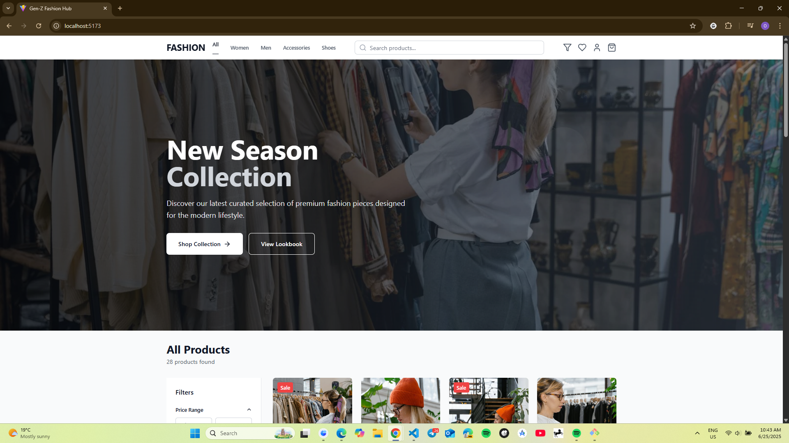
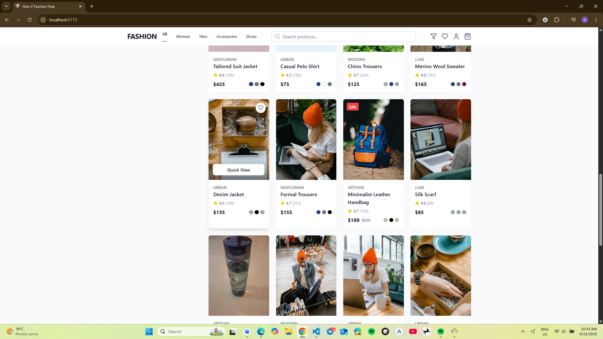
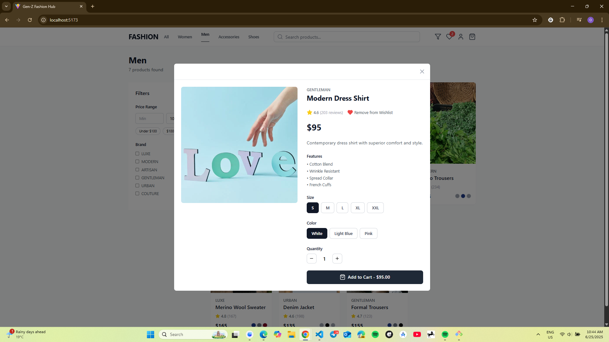
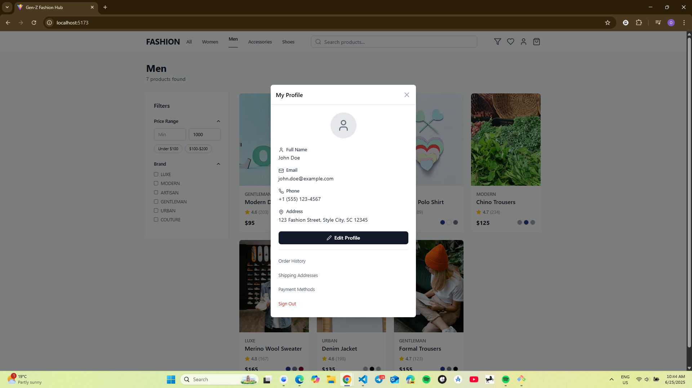

# 🛍️ Gen-Z Fashion

An elegant, well crafted and responsive fashion web app built with Vite, React, TypeScript, and Tailwind CSS. Users can browse, filter, and manage their wishlist, cart, and profile in a seamless shopping experience.

## ✨ Features

- 🧾 Product listing with filters
- ❤️ Wishlist functionality
- 🛒 Shopping cart
- 🧑‍💼 User profile
- 🎨 Responsive design with Tailwind CSS
- ⚡ Fast performance using Vite

## 🛠️ Tech Stack

- React & TypeScript
- Tailwind CSS
- Vite
- ESLint + Prettier

## 📦 Getting Started

## 📸 Screenshots

### 🏠 Homepage

### 🛒 Product List

### ❤️ Cart / Wishlist

### 📦 Profile

